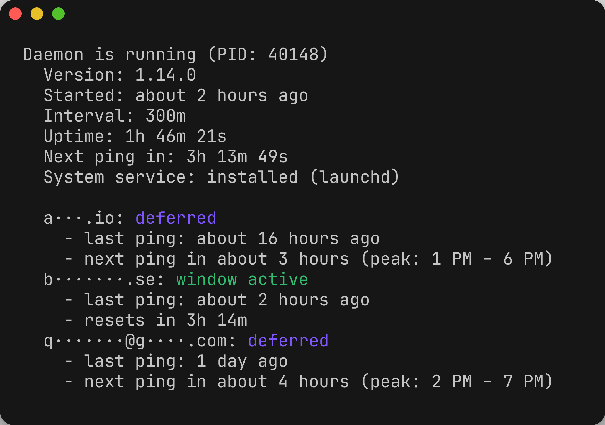

# @wbern/cc-ping

[](https://www.npmjs.com/package/@wbern/cc-ping)
[](https://www.npmjs.com/package/@wbern/cc-ping)
[](https://github.com/wbern/cc-ping/actions/workflows/ci.yml)
[](https://opensource.org/licenses/MIT)

<p align="center">
  
</p>

**Ping Claude Code sessions to trigger quota windows early across multiple accounts.**

Claude Code has a 5-hour quota window that starts on your first message. If you rotate between accounts, your idle accounts sit there with full quota doing nothing. cc-ping pings them so their windows start ticking — when you need them, they've already reset.

Zero telemetry. No data is collected, sent, or phoned home. Everything stays in `~/.config/cc-ping/`. The only network activity is the `claude` CLI call itself, which is subject to Anthropic's normal Claude Code telemetry.

## Prerequisites

[Claude Code](https://docs.anthropic.com/en/docs/claude-code) must be installed and on your PATH.

```bash
claude --version   # verify it's available
```

## Quick run (no install)

```bash
pnpm dlx @wbern/cc-ping ping
```

## Install

```bash
pnpm add -g @wbern/cc-ping
```

```bash
npm install -g @wbern/cc-ping   # also works
```

## Setup

Discover accounts from `~` (or a custom directory), then verify they have valid credentials:

```bash
cc-ping scan              # auto-discover accounts from ~
cc-ping scan /path/to/dir # scan a specific directory
cc-ping check             # verify credentials are valid
cc-ping list              # show configured accounts
```

Or add accounts manually:

```bash
cc-ping add my-account ~/.claude-accounts/my-account
```

## Usage

```bash
cc-ping ping                          # ping all accounts
cc-ping ping alice bob                # ping specific accounts
cc-ping ping --parallel               # ping all at once
cc-ping ping --notify                 # desktop notification on new windows
cc-ping ping --bell                   # terminal bell on failure
cc-ping ping --stagger 5s             # wait 5s between each account
cc-ping status                        # show account status table
cc-ping suggest                       # which account should I use next?
cc-ping next-reset                    # when does the next window expire?
cc-ping daemon start --interval 300m  # auto-ping every 5 hours
cc-ping history                       # recent ping results
```

## Commands

### `cc-ping ping [handles...]`

Ping configured accounts to start their quota windows. Pings accounts sequentially by default.

| Flag | Default | Description |
|------|---------|-------------|
| `--parallel` | `false` | Ping all accounts simultaneously |
| `--stagger <duration>` | — | Wait between each account (e.g. `5s`, `1m`) |
| `--notify` | `false` | Desktop notification when new windows open |
| `--bell` | `false` | Terminal bell on failure |
| `--json` | `false` | Output results as JSON |
| `--quiet` | `false` | Suppress per-account output |
| `--group <name>` | — | Only ping accounts in this group |

### `cc-ping status`

Show all accounts with their quota window state — whether they have an active window, when it resets, and duplicate detection.

### `cc-ping suggest`

Recommend which account to use next based on quota window state. Prefers accounts that need pinging or whose windows are about to reset.

### `cc-ping next-reset`

Show which account has its quota window resetting soonest — useful for knowing when capacity frees up.

### `cc-ping scan`

Auto-discover Claude Code accounts. Scans `~` by default, or pass a directory to scan. Each subdirectory containing a `.claude.json` is detected as an account. Duplicate identities (same `accountUuid` across directories) are flagged.

### `cc-ping check`

Verify that each configured account's config directory exists and has credentials.

### `cc-ping add <handle> <config-dir>`

Manually add an account by name and Claude Code config directory path.

### `cc-ping remove <handle>`

Remove an account from the configuration.

### `cc-ping list`

List all configured accounts with their config directory paths.

### `cc-ping history`

Show recent ping results — handle, success/failure, duration, cost.

### `cc-ping schedule reset [handle]`

Reset smart scheduling data to recompute optimal ping times. Pass a handle to reset a specific account, or omit it to reset all accounts.

### `cc-ping completions <shell>`

Generate shell completion scripts for `bash`, `zsh`, or `fish`.

### `cc-ping moo`

Send a test desktop notification to verify notifications work on your platform.

## Daemon

The daemon auto-pings on a schedule so you don't have to remember.

```bash
cc-ping daemon start --interval 300m   # every 5 hours
cc-ping daemon status                  # check if running, next ping time
cc-ping daemon stop                    # graceful shutdown
```

| Flag | Default | Description |
|------|---------|-------------|
| `--interval <duration>` | `300m` | Time between ping cycles |
| `--smart-schedule <on\|off>` | `on` | Time pings based on your usage patterns |
| `--notify` | `false` | Desktop notification when new windows open |
| `--bell` | `false` | Terminal bell on failure |
| `--quiet` | `true` | Suppress per-account output in logs |

The daemon is smart about what it pings:

- **Skips active windows** — accounts with a quota window still running are skipped to avoid wasting pings
- **Detects recent usage** — if you've been using Claude Code directly, the account already has an active window. The daemon detects this from Claude Code's activity timestamps and skips the ping
- **Retries failures** — if any accounts fail to ping, the daemon retries only the failed ones before sleeping
- **Detects system sleep** — if the machine wakes from sleep and a ping cycle is overdue, the daemon notices and factors the delay into notifications
- **Singleton enforcement** — only one daemon runs at a time, verified by PID and process name
- **Graceful shutdown** — `daemon stop` writes a sentinel file and waits up to 60s for a clean exit before force-killing
- **Auto-restart on upgrade** — after upgrading cc-ping, the daemon detects the binary has changed and exits so the service manager can restart it with the new version. `daemon status` warns if the running daemon is outdated

Logs are written to `~/.config/cc-ping/daemon.log`.

### Smart scheduling

By default, the daemon analyzes your Claude Code usage history to time pings optimally. The goal: your 5-hour quota window expires right when you're most active, not while you're asleep.

```
Your typical day:

      12am      6am       12pm      6pm       12am
        |        |    ________|________  |        |
        .  .  .  .  . |  coding time  |  .  .  .  .
                            ^
                       peak activity

Fixed interval -- ping fires whenever the timer says:

        [======= 5h window =======]
       12am                       5am
                                   ^ expires while you sleep

Smart scheduling -- ping timed so window expires at peak:

                      [======= 5h window =======]
                     8am                        1pm
                                                 ^ expires while you code!
```

**How it works:**

1. Reads Claude Code's `history.jsonl` from each account's config directory (prompt timestamps written by the Claude CLI — not to be confused with cc-ping's own `history.jsonl`)
2. Builds an hour-of-day histogram from the last 14 days
3. Slides a 5-hour window across the histogram to find the densest period
4. Schedules pings so the window expires at the midpoint of peak activity

**Defer zone:** When smart scheduling is active, pings that would fire in the 5 hours before the optimal time are deferred. Pings outside this zone proceed normally for continuous coverage.

**Fallback:** If an account has fewer than 7 days of history or a flat usage pattern (no clear peak), smart scheduling is skipped and the fixed interval is used instead.

To disable: `cc-ping daemon start --smart-schedule off`

### System service (survive reboots)

`daemon start` runs as a detached process that won't survive a reboot. Use `daemon install` to register as a system service that starts automatically on login:

```bash
cc-ping daemon install --interval 300m --notify   # install and start
cc-ping daemon status                              # shows "System service: installed"
cc-ping daemon uninstall                           # remove service and stop
```

| Platform | Service manager | Service file |
|----------|----------------|--------------|
| macOS | launchd | `~/Library/LaunchAgents/com.cc-ping.daemon.plist` |
| Linux | systemd (user) | `~/.config/systemd/user/cc-ping-daemon.service` |

The service restarts the daemon on crash (but not on clean exit via `daemon stop`). No `sudo` required — both use user-level service managers.

**`daemon stop` vs `daemon uninstall`:** When a service is installed, `daemon stop` kills the process but the service manager may restart it on crash. Use `daemon uninstall` to fully remove the service, or `daemon stop` if you just need a temporary pause.

## Notifications

Desktop notifications work on macOS, Linux, and Windows:

| Platform | Mechanism |
|----------|-----------|
| macOS | `osascript` (AppleScript `display notification`) |
| Linux | `notify-send` |
| Windows | PowerShell `New-BurntToastNotification` |

Use `cc-ping moo` to verify notifications work on your system.

## Shell completions

```bash
# bash
cc-ping completions bash >> ~/.bashrc

# zsh
cc-ping completions zsh >> ~/.zshrc

# fish
cc-ping completions fish > ~/.config/fish/completions/cc-ping.fish
```

## How it works

Each ping spawns the `claude` CLI with a trivial arithmetic prompt:

```bash
claude -p "Quick, take a guess: what is 2847 + 6192?" \
  --output-format json \
  --tools "" \
  --max-turns 1
```

The account is selected by setting `CLAUDE_CONFIG_DIR` to the account's config directory, so the `claude` CLI authenticates as that account.

Key design choices:

- **Arithmetic prompts** — random math questions minimize token usage (~150 input tokens, ~10 output). Templates and operands are randomized to avoid cache hits across pings.
- **Tools disabled** — `--tools ""` prevents the model from doing anything beyond answering the question.
- **Single turn** — `--max-turns 1` ensures one request-response cycle, no follow-ups.
- **30s timeout with hard kill** — pings that take longer are sent SIGKILL. A backstop timer force-resolves the promise even if the child process doesn't exit cleanly.
- **Cost tracking** — each ping records its USD cost and token usage so you can audit spend.

After a successful ping, the account's last-ping timestamp is saved to `~/.config/cc-ping/state.json`. The 5-hour quota window is calculated from this timestamp — commands like `status`, `suggest`, and the daemon all use it to determine window state.

## Privacy

cc-ping sends **zero telemetry**. No analytics, no tracking, no phoning home.

All data stays local in `~/.config/cc-ping/`:

| File | Contents |
|------|----------|
| `config.json` | Account names and config directory paths |
| `state.json` | Last ping timestamp and cost metadata per account |
| `history.jsonl` | Ping history (timestamp, handle, success/failure, duration) |
| `daemon.json` | Daemon PID, interval, start time |
| `daemon.log` | Daemon output log |

The only network activity is the `claude` CLI call itself, which communicates with Anthropic's API under their standard [terms](https://www.anthropic.com/terms) and [privacy policy](https://www.anthropic.com/privacy). cc-ping does not intercept, modify, or inspect this traffic beyond reading the JSON response for cost metadata.

## License

MIT
